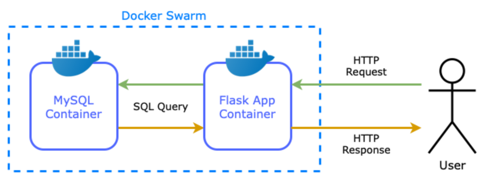
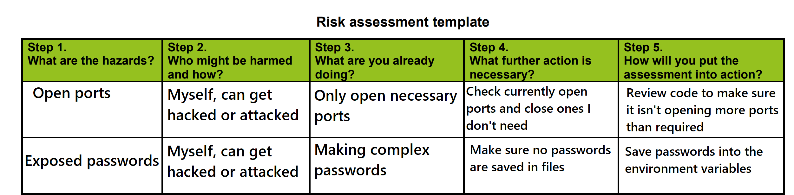
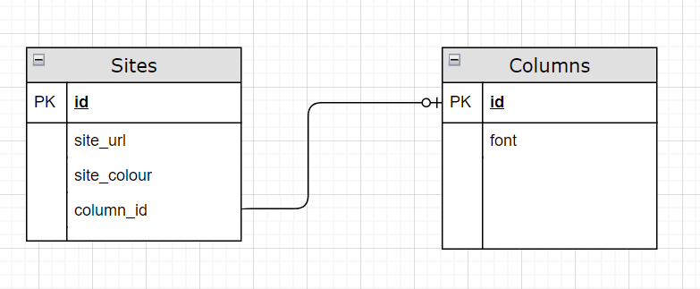

# How to run it

## 1. Pull the main branch into a folder.

## 2. Enter the folder and run the app using docker-compose:-

      ```
      docker-compose up -d --build
      ```

## 3. Access the Application:

      ```
      http://localhost:5000/
      ```

# Testing

## To run the tests you must have the app running and run this command:

      ```
      docker exec flask_app python -m unittest discover
      ```

# Video Demo

The video can be found at https://www.dropbox.com/s/l0xz1eqsuxfb7vt/2022-08-08%20-%20Qa%20Project%20Demo.mp4?dl=0

# About the App

This web app allows you do add sites you regularly use and would like to see the status of. This is useful to know if only one website is down or multiple are affected at once. It sorts out the sites into three columns and you can choose the position and font colour of the site status. Each column has its own font style which is grabbed from the Columns table in the database. On new deployments the database is not reset as the data is stored in Docker Volumes which are persistent. The tools used are:
- GitHub
- Flask
- MySQL
- Docker
- Jenkins



## Risk Assessment



## Entity Relationship Diagram



## CI/CD Pipeline


## What Can Be Improved?

- The 'Columns' database could be modified to include custom fonts via a new page dedicated to modifying the value of 'font'.
- More CSS could be added to stylize the page and make text more readable
- Unit tests that run on pull request
- Create a login system that allows multiple users to have their own list of sites they want to see
